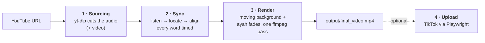

# Tilawa.io

**Turn any Quran recitation on YouTube into a calm, beautifully subtitled vertical video — automatically.**

Give it a YouTube link. It listens to the recitation, works out which surah and ayahs are being recited, and shows each ayah in the Uthmani script at the exact moment the reciter begins it, including repeats and pauses. The ayahs appear over a slow, moving background. Optionally it posts the result to TikTok.

- 🎧 **Accurate sync:** handles repeated ayahs (whole or partial), pauses, late starts, isti'adha/basmala, and clips cut mid-ayah. Measured against exact ground truth: ≤ 0.1 s error.
- 🕌 **Beautiful text:** King Fahd Complex Uthmani font, gold ayah markers, gentle fade-ins, long ayahs auto-fit or paginate.
- 🌌 **Living backgrounds:** the sheikh's own video (sharp, then softly blurred as recitation begins), or a calm ambient scene that breathes with the voice.
- 🆓 **Free and local:** no paid APIs and no required keys. The models run on your machine.

---

## Quick start

```bash
# 1. Prerequisites: Python 3.10+ and ffmpeg
brew install ffmpeg                  # or: sudo apt install ffmpeg

# 2. Install
git clone https://github.com/tersawwy/Tilawa.io.git
cd Tilawa.io
python3 -m venv .venv && source .venv/bin/activate
pip install -r requirements.txt
playwright install chromium

# 3. Make a video (first run downloads ~1.8 GB of models)
python main.py --url "https://www.youtube.com/watch?v=7RHYNhg8xEg" --duration 45 --no-upload
```

Your video is at `output/final_video.mp4`.

👉 **Full step-by-step guide: [docs/01-getting-started.md](docs/01-getting-started.md)**

---

## Common commands

```bash
# Automatic: surah, ayahs, repeats and pauses detected from the audio
python main.py --url "<YouTube URL>" --duration 45 --no-upload

# Start at a point in a long video
python main.py --url "<YouTube URL>" --start-time 00:12:30 --duration 50 --no-upload

# Use the sheikh's own video as the background
python main.py --url "<YouTube URL>" --duration 45 --background video --no-upload

# Force the passage if auto-detection gets it wrong
python main.py --url "<YouTube URL>" --surah 67 --start-ayah 1 --end-ayah 5 --no-upload

# Landscape (YouTube) instead of vertical
python main.py --url "<YouTube URL>" --duration 60 --aspect landscape --no-upload

# Render and post to TikTok (see docs/04-tiktok-upload.md first)
python main.py --url "<YouTube URL>" --duration 45
```

| Flag | Default | Description |
|---|---|---|
| `--url` | *(required)* | YouTube URL |
| `--start-time` | `00:00:00` | Where to start in the video |
| `--duration` | `58` | Seconds to cut |
| `--background` | `ambient` | `ambient` (calm moving scene) or `video` (the sheikh's video) |
| `--surah` `--start-ayah` `--end-ayah` | auto | Manual passage (give all three) |
| `--aspect` | `portrait` | `portrait` 1080×1920 or `landscape` 1920×1080 |
| `--style` | `mushaf` | `mushaf` (whole ayah) or `word-pop` (legacy, one word at a time) |
| `--output` | `output/final_video.mp4` | Output path |
| `--no-upload` | off | Don't post to TikTok |
| `--config` | `config.yaml` | Config file |

More in the **[Usage Guide](docs/02-usage.md)** and the **[Configuration Reference](docs/03-configuration.md)**.

---

## How it works



1. **Sourcing:** yt-dlp downloads exactly the requested section, falling back to a full download and a local trim if YouTube refuses.
2. **Sync:** an Arabic speech model (wav2vec2) and a Quran-tuned Whisper both listen to the audio. A Viterbi search places every heard word in the Quran text, allowing repeats, skips and non-Quran speech. Each run of words is then force-aligned for exact timings. → [Deep dive](docs/deep-dive/sync.md)
3. **Render:** Chromium shapes each ayah in the Uthmani font, and ffmpeg composes the fades over the background with the audio. On Apple Silicon it uses hardware H.264 encoding, so a 45 s clip renders in about 35 s. → [Deep dive](docs/deep-dive/rendering.md)
4. **Upload (optional):** headless Chromium posts to TikTok using your exported browser cookies. → [Guide](docs/04-tiktok-upload.md)

Architecture, workflows and design decisions: **[docs/](docs/README.md)**

---

## Requirements

| | |
|---|---|
| Python | 3.10+ (tested on 3.12) |
| ffmpeg | 5+ on your `PATH` |
| Disk | ~3 GB (models are downloaded once to `~/.cache/huggingface`) |
| RAM | 8 GB minimum, 16 GB recommended |
| OS | macOS (Apple Silicon fastest) or Linux; Windows untested |

**Optional:**
- A free [Pexels](https://www.pexels.com/api/) key in `.env` for real nature footage (`cp .env.example .env`).
- TikTok cookies for posting.

---

## Documentation

| Guide | |
|---|---|
| [Getting Started](docs/01-getting-started.md) | Install and first video, step by step |
| [Usage Guide](docs/02-usage.md) | Flags, recipes, choosing clips |
| [Configuration](docs/03-configuration.md) | Every setting |
| [TikTok Upload](docs/04-tiktok-upload.md) | Cookies, captions, privacy |
| [Architecture](docs/05-architecture.md) · [Workflows](docs/06-workflows.md) | How it's built |
| [Testing](docs/07-testing.md) | Unit tests and the sync benchmark |
| [Troubleshooting & FAQ](docs/08-troubleshooting.md) | Fixes for common problems |

---

## Data sources

| Source | Used for | Auth |
|---|---|---|
| [Quran.com API v4](https://api.quran.com/api/v4) | Word-by-word Uthmani text, surah names | none |
| [alquran.cloud](https://alquran.cloud/api) | Quran text index for detection, fallback data | none |
| [Hugging Face](https://huggingface.co) | [`wav2vec2-large-xlsr-53-arabic`](https://huggingface.co/jonatasgrosman/wav2vec2-large-xlsr-53-arabic), [`whisper-base-ar-quran`](https://huggingface.co/tarteel-ai/whisper-base-ar-quran) | none |
| [Pexels](https://www.pexels.com/api/) / [Pixabay](https://pixabay.com/api/docs/) | Optional stock footage | free key |
| [everyayah.com](https://everyayah.com) | Per-ayah audio for the sync benchmark | none |

---

## ⚠️ About TikTok automation

Browser-automated posting violates TikTok's Terms of Service. Use a dedicated account, keep `tiktok.privacy: "private"` while testing, expect to re-export cookies about every 30 days, and expect UI changes to break it occasionally. `--no-upload` plus a manual upload always works.

---

## Testing

```bash
pip install pytest
python -m pytest tests -q          # 41 offline tests, a few seconds
python tests/bench_sync.py         # sync accuracy vs exact ground truth (network + models)
```
