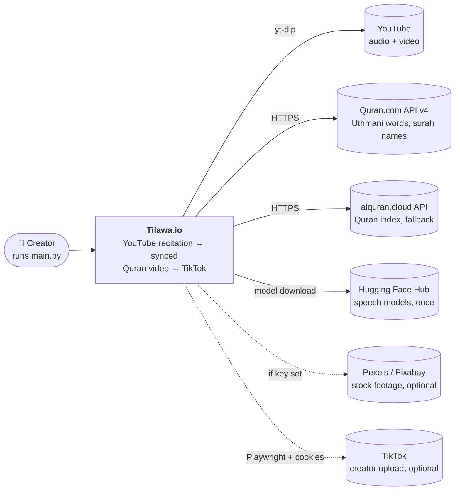
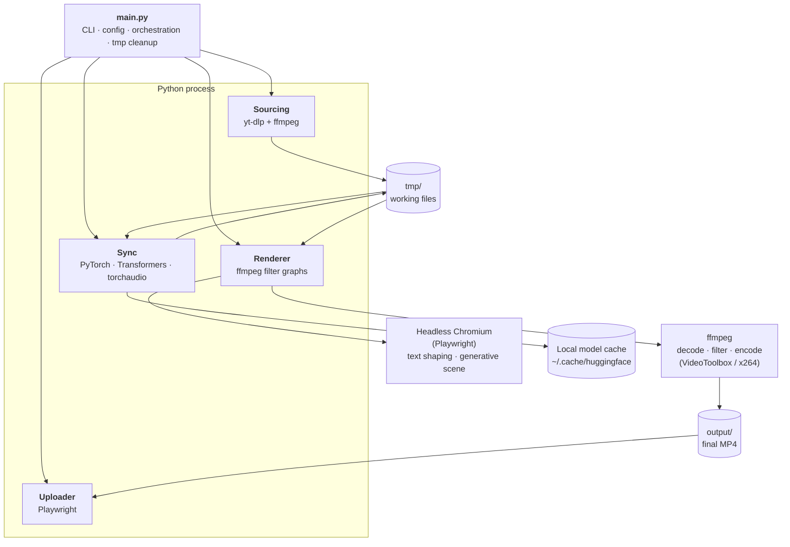
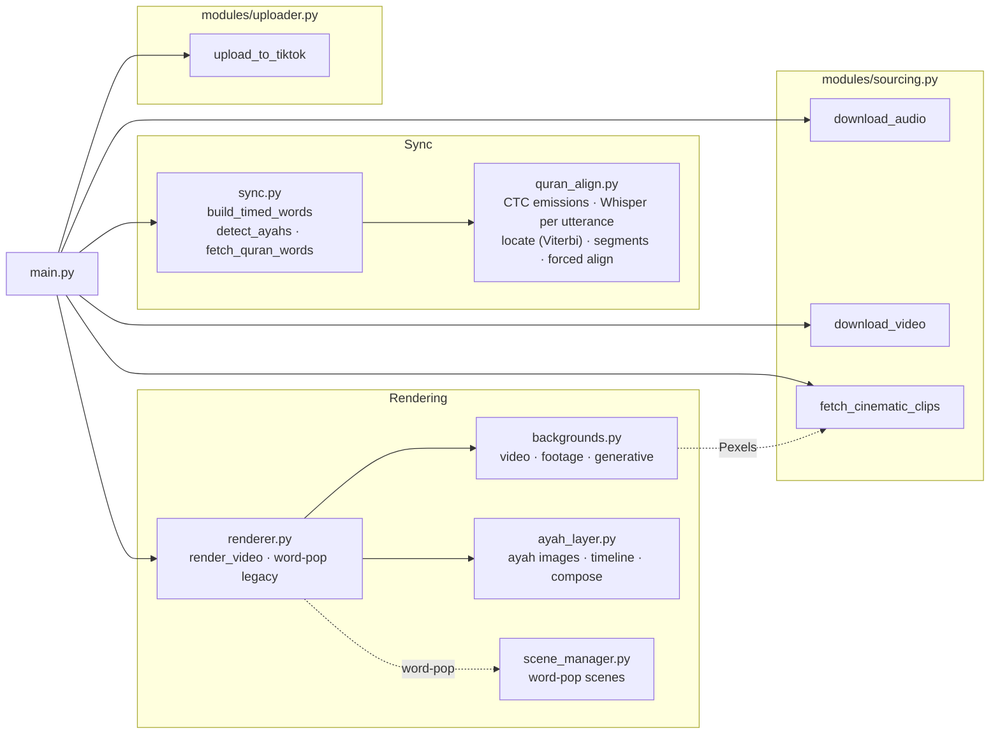

# 5. Architecture Overview

Tilawa.io is a **single-process Python CLI pipeline**: one command runs four stages in sequence, passing files through a working directory (`tmp/`). There is no server, database or background service.

---

## System context (C4 level 1)

Who and what the system talks to.

| External system | Used for | Auth |
|---|---|---|
| YouTube | Source audio (and video for `--background video`) | none (yt-dlp) |
| [Quran.com API v4](https://api.quran.com/api/v4) | Word-by-word Uthmani text, Arabic/English surah names | none |
| [alquran.cloud](https://alquran.cloud/api) | Full Quran text for surah detection (cached), fallbacks | none |
| Hugging Face Hub | Downloads the two speech models on first run | none |
| Pexels / Pixabay | Stock footage (optional) | free API key |
| TikTok | Posting (optional) | browser session cookies |

---

## Containers (C4 level 2)

The runtime pieces inside one `python main.py` process.

---

## Components (C4 level 3)

### Module breakdown

| Module | Purpose | Key functions | Depends on |
|---|---|---|---|
| `main.py` | CLI, config/`.env` loading, runs the stages, cleans `tmp/` | `main`, `clean_tmp`, `load_dotenv` | all modules |
| `modules/sourcing.py` | Download audio/video from YouTube (with 403 fallback); fetch stock clips | `download_audio`, `download_video`, `fetch_cinematic_clips` | yt-dlp, ffmpeg, requests |
| `modules/sync.py` | Orchestrates sync; surah detection; Quran text; post-processing | `build_timed_words`, `detect_ayahs`, `fetch_quran_words`, `get_surah_name` | `quran_align`, Quran APIs |
| `modules/quran_align.py` | The alignment engine: models, Viterbi locator, CTC forced alignment | `ctc_emissions`, `greedy_words`, `transcribe_utterances`, `locate`, `segments_from_path`, `align_words_ctc` | torch, torchaudio, transformers |
| `modules/renderer.py` | Render entry point; mushaf pipeline; legacy word-pop (MoviePy) | `render_video`, `_render_mushaf` | `backgrounds`, `ayah_layer`, moviepy |
| `modules/backgrounds.py` | Build the moving background video; choose encoder | `build_background`, `render_video_bg`, `render_footage_bg`, `render_generative`, `encoder_args` | ffmpeg, Playwright |
| `modules/ayah_layer.py` | Ayah text images, display timeline, final ffmpeg compose | `render_text_images`, `build_intervals`, `build_compose_cmd`, `make_overlay` | Playwright, ffmpeg |
| `modules/scene_manager.py` | Word-pop: cut B-roll scenes on phrase pauses | `build_scenes` | — |
| `modules/uploader.py` | Post to TikTok via headless browser + cookies | `upload_to_tiktok` | Playwright |

---

## Architectural patterns

- **Pipeline / pipes-and-filters.** Each stage reads the previous stage's output file and writes its own (`audio.mp3 → timed_words.json → bg.mp4 + text PNGs → final.mp4`). Stages are independently testable and inspectable.
- **Files as the integration contract.** `tmp/timed_words.json` is the key interface between sync and rendering: a flat list of words with `ayah_number`, `word_index`, `text`, `start`, `end`, `segment_id`. Any renderer can consume it.
- **Offload heavy work to specialised engines.** Text shaping goes to a real browser (HarfBuzz), video processing to ffmpeg, math to PyTorch. Python orchestrates.
- **Pure core, thin I/O shell.** The alignment decisions (`locate`, `segments_from_path`) and render timeline (`build_intervals`, `build_compose_cmd`) are pure functions with offline unit tests; models, network and ffmpeg calls sit at the edges.
- **Graceful fallbacks** everywhere: section download → full download + trim; Pexels → generative scene; Whisper words ↔ CTC words (whichever aligns better); hardware encoder → x264.

---

## Key design decisions

1. **Listen first, then locate, then align (sync).**
   - *Rationale:* forcing a *guessed* text onto the audio breaks the moment the guess is wrong (a repeat, a restart, a skipped basmala). Locating what was actually heard handles repeats, partial repeats, pauses and late starts naturally.
   - *Trade-off:* two speech models (~1.8 GB) instead of one.

2. **Two word sources, keep the better one.**
   - *Rationale:* the wav2vec2 CTC model never merges repeated phrases and gives exact timings, but shatters words in heavily melodic recitation; the Quran-tuned Whisper is the opposite. Running both and keeping whichever aligns more words is robust across recitation styles.
   - *Trade-off:* ~30% more sync time.

3. **Browser for Arabic text.**
   - *Rationale:* the Uthmani script needs full OpenType shaping (stacked marks, ligatures). Pillow can't do it correctly; Chromium can.
   - *Trade-off:* Playwright + Chromium dependency.

4. **Compose with one ffmpeg filter graph, not frame-by-frame Python.**
   - *Rationale:* the text only changes at ayah boundaries, so ffmpeg overlays with time expressions do it natively; only the background is animated per frame. ~2.5× faster than the old MoviePy loop.
   - *Trade-off:* filter graphs are harder to read — so `build_compose_cmd` is a pure, unit-tested function.

5. **Hardware encoding when available.**
   - *Rationale:* encoding 1080×1920 video (with anti-banding film grain) was the real bottleneck; Apple VideoToolbox is ~5× faster than x264.
   - *Trade-off:* slightly larger files (8 Mbps target); TikTok re-encodes anyway.

6. **Keep the legacy `word-pop` style untouched.**
   - *Rationale:* it still works for users who want it; the redesign focused on the default `mushaf` style.
   - *Trade-off:* two render paths (MoviePy for word-pop).

---

**Next:** [Workflows →](06-workflows.md)
