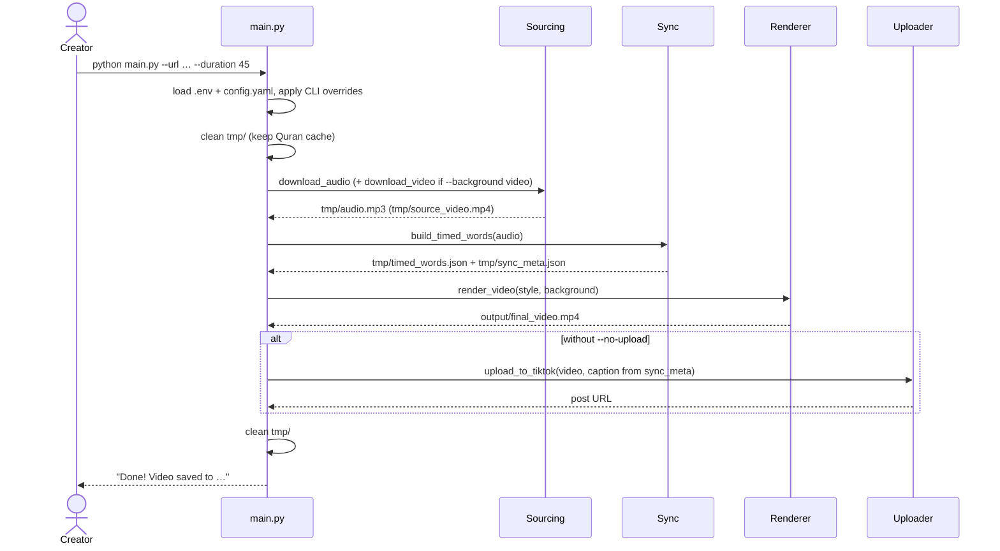
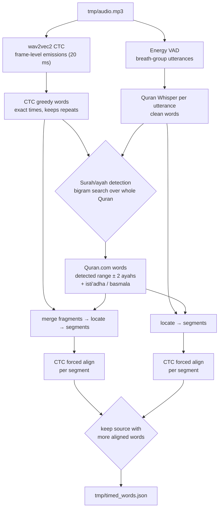
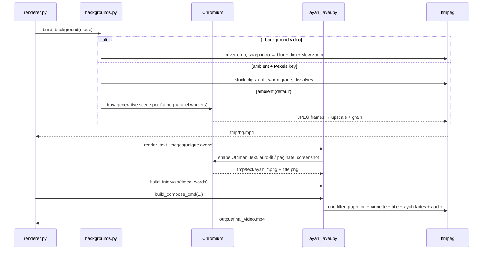
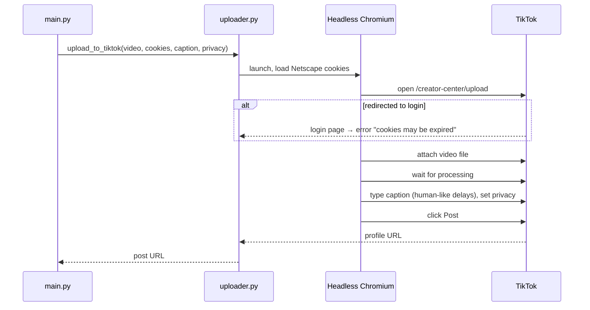
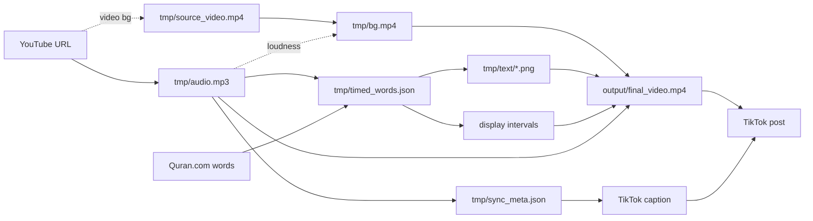

# 6. Workflows

How a run flows through the system, stage by stage.

---

## Workflow 1: End-to-end run



**Steps**

1. **Configure.** `.env` → environment, `config.yaml` loaded, CLI flags override `style`, `aspect`, `background`, `duration`.
2. **Clean.** `tmp/` is emptied so no stale audio/timings leak into a new video.
3. **Source.** yt-dlp cuts exactly the requested section. If YouTube refuses the section download (HTTP 403), the full track is downloaded and trimmed locally.
4. **Sync.** Produces the timed word list (see Workflow 2).
5. **Render.** Produces the video (Workflow 3).
6. **Upload** (optional). Caption uses the surah detected in step 4.
7. **Clean** `tmp/` again.

---

## Workflow 2: Sync — "listen, locate, align"



**Steps**

1. **Listen.** The wav2vec2 model produces per-frame letter probabilities for the whole clip; a greedy decode gives words with exact times. Separately the audio is split at pauses and each breath group is transcribed by the Quran-tuned Whisper.
2. **Detect** the surah and ayah range by comparing the transcripts with every window of the Quran (character-bigram overlap). Skipped when `--surah/--start-ayah/--end-ayah` are given.
3. **Locate.** A Viterbi search assigns every heard word to a position in the Quran text. Allowed moves: next word, skip a missed word, **jump back (repeat — whole or partial ayah)**, jump ahead, or *not Quran* (dua, talk, applause).
4. **Segment.** Runs of consecutive positions become segments; every jump back starts a new one (a repeat).
5. **Align.** Each segment's exact Quran text is force-aligned on its own audio window → precise word start/end. Segment edges are extended to the ayah boundary when the audio supports it (the recogniser often misses an ayah's first word).
6. **Choose** whichever word source produced more confidently aligned words.
7. **Save** timed words and `sync_meta.json`; print the recitation map.

Details: [Deep Dive: Sync](deep-dive/sync.md).

---

## Workflow 3: Rendering (mushaf style)



The `word-pop` style instead renders frame by frame with MoviePy over B-roll scenes (see [Deep Dive: Rendering](deep-dive/rendering.md#legacy-word-pop-style)).

---

## Workflow 4: TikTok upload



---

## Data flow



### `timed_words.json` format

```json
[
  {
    "ayah_number": 2,
    "word_index": 0,
    "text": "ٱلْحَمْدُ",
    "english_text": "[All] praise is [due] to Allah, Lord of the worlds -",
    "start": 1.96,
    "end": 2.84,
    "segment_id": 0,
    "confidence": -0.412,
    "display_start": 1.96,
    "display_end": 2.84
  }
]
```

- `ayah_number` `0` = basmala (shown without an ayah marker).
- A repeated ayah appears again with a higher `segment_id`.
- `display_start/end` are used by the word-pop style.

---

## State management

There is no persistent state besides two caches:

- `tmp/quran_clean.json` — diacritic-free Quran text for surah detection (kept between runs).
- `~/.cache/huggingface/` — the downloaded models.

Everything else is per-run and deleted at the start and end of each run.

## Error handling

| Situation | Behaviour |
|---|---|
| YouTube 403 on section download | Automatic fallback: download full track, trim locally |
| No Arabic recognised / detection confidence < 25% | Stops with a message asking for `--surah/--start-ayah/--end-ayah` |
| Quran Whisper fails to load | Continues with CTC words only |
| A segment aligns badly | Falls back to rough timing; tiny weak segments are dropped |
| Pexels returns nothing | Falls back to the generative scene |
| No hardware encoder | Falls back to x264 |
| ffmpeg compose fails | Raises with the last 2,000 characters of ffmpeg's error output |
| TikTok UI element not found | Logs a `Warning:` and continues; login redirect raises |

---

**Next:** [Testing →](07-testing.md)
