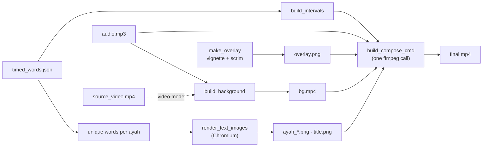
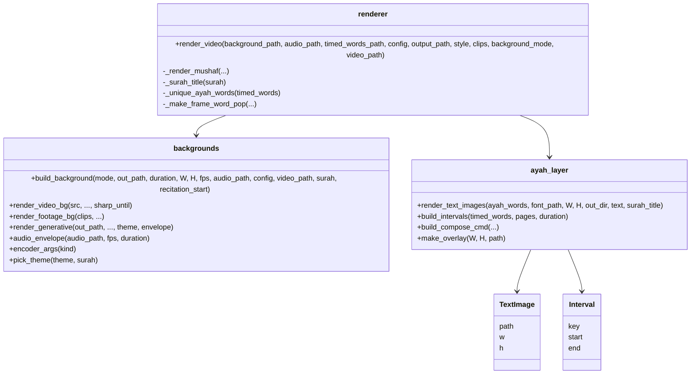

# Deep Dive: Rendering

**Files:** [`modules/renderer.py`](../../modules/renderer.py) (entry point, word-pop) · [`modules/backgrounds.py`](../../modules/backgrounds.py) (moving background) · [`modules/ayah_layer.py`](../../modules/ayah_layer.py) (ayah text, timeline, compose) · [`modules/scene_manager.py`](../../modules/scene_manager.py) (word-pop scenes)

**Input:** `tmp/timed_words.json`, `tmp/audio.mp3` (+ `tmp/source_video.mp4`) · **Output:** the final MP4

---

## Overview

The default **mushaf** style shows each ayah as a whole, fading in as the reciter starts it, over a calm moving background. The design goal is a video that feels quiet and absorbing: no boxes, no bars, slow motion only.

Rendering is split into layers that are built once and composed in a single ffmpeg pass:

Only the background changes every frame; text changes only at ayah boundaries — so ffmpeg overlays with time expressions do all the animation natively.

---

## Responsibilities

- Build a full-length, graded, moving background video
- Shape and lay out each ayah beautifully (auto-fit, pagination)
- Decide when each ayah is on screen (repeats, breaths, long pauses)
- Compose everything with the audio into the final video
- Keep the legacy word-pop style working

---

## Architecture

---

## Implementation details

### Backgrounds (`backgrounds.py`)

`build_background(mode, …)` always produces `tmp/bg.mp4`: full length, full resolution, already graded.

**`video` — the sheikh's own footage** (`render_video_bg`)

- Cover-crop to the output aspect.
- **Sharp intro:** plays sharp until 1 s before the first subtitled word (`sharp_until`), then a 1.2 s `xfade` dissolve into the soft version — timed so it finishes as the first ayah fades in. Disabled with `background.video_sharp_intro: false`, or automatically if recitation starts in the first ~1.3 s.
- **Soft version:** blurred at ⅓ resolution (same look, much faster), `eq` dimming (−0.14) and desaturation (0.8), and a 5% push-in over the clip via `zoompan`. The blur also hides any text burned into the source.

**`ambient` + Pexels key — nature footage** (`render_footage_bg`)

- Clips from `fetch_cinematic_clips` (Pexels search over `sourcing.background_queries`), ~9 s each, looped as needed.
- Cover-scaled 6% oversize with a slow vertical drift (a cheap crop pan — full-resolution `zoompan` was ~3× slower).
- Warm grade in one `eq` pass (slight desaturation, gamma tint); 1.5 s `xfade` dissolves between clips.

**`ambient` without a key — generative scene** (`render_generative`)

A `<canvas>` scene in headless Chromium, drawn deterministically for time `t`:

- deep two-colour base gradient (theme palette)
- four large soft light blobs on slow Lissajous paths, screen-blended (aurora feel)
- warm horizon glow from below, and a softly blurred light beam from above that sways very slowly
- two particle layers: ~60 tiny far motes and 9 large soft near bokeh, rising slowly and twinkling
- **breathing with the voice:** overall glow follows the smoothed audio loudness (`audio_envelope`: fast attack, slow release, 0.82→1.0) so the scene swells gently with recitation and settles in pauses
- seeded PRNG → the same surah always renders identically

Themes: `night` (indigo → teal), `dawn` (plum → amber), `emerald` (deep green); `auto` picks by surah number.

Performance: drawn at ½ resolution (the scene is soft by design), in parallel worker processes over frame ranges (one Chromium each), JPEG frames piped to ffmpeg, upscaled with fine film grain (prevents banding in dark gradients), then the parts are concatenated losslessly.

**Encoder choice** (`encoder_args`): `h264_videotoolbox` when ffmpeg has it (Apple Silicon, ~5× faster), else `libx264 -preset veryfast`. The intermediate `bg.mp4` gets a higher bitrate/quality than the final.

### Ayah text (`ayah_layer.render_text_images`)

Each ayah is rendered **once** as a tightly cropped transparent PNG by Chromium (HarfBuzz shapes the Uthmani script correctly; Pillow can't):

- Scheherazade New font embedded as a data URI; warm ivory (`#F4EEDD`), line height 2.05, soft dark shadow plus a faint warm halo — **no fake bold** (it ruins this font).
- The ayah-end marker `۝` + Arabic-Indic number is gold (`#D8B46A`) and glued to the last word with a non-breaking span, so it never wraps onto a line alone. The basmala (ayah 0) has no marker.
- **Auto-fit:** font size steps down from `max_size` (108) to `min_size` (64) until the block fits the text zone (44% of the height). Still too tall → the ayah is **paginated** at word boundaries into evenly sized pages; each page is shown from the time of its first word.
- Repeated recitations reuse the same image (`_unique_ayah_words`).
- A small surah title (`سورة الملك`) with thin gold rules is rendered the same way.

### Timeline (`ayah_layer.build_intervals`)

Turns timed words into on-screen intervals:

1. Consecutive words showing the same image (same ayah + page) form a **run**. A repeat of the ayah that's already showing just extends the run — no flicker.
2. Each run fades in 0.35 s before its first word.
3. If the next run starts within **4 s** (a breath), this one stays until the next begins, overlapping by 0.15 s — a short dissolve where two ayahs are never both at full opacity.
4. After a **longer pause**, it holds 1.6 s past its last word, fades out, and the next run fades in when recitation resumes.

### Compose (`ayah_layer.build_compose_cmd`)

One ffmpeg command, built by a pure (unit-tested) function:

- inputs: `bg.mp4`, the static overlay (numpy-generated vignette + a soft dark scrim behind the text zone), the title PNG, each used ayah PNG once, the audio
- title fades in with the first ayah
- each interval: the ayah image stream is **trimmed to its own interval and time-shifted** (`setpts=…+start/TB`), so frames are processed only while it's visible; `fade` in (0.8 s) / out (0.4 s) on alpha; overlaid centred with a 16 px upward drift that eases out during the fade-in
- images used by several intervals (repeats) are `split`
- output H.264 (see encoder choice) + AAC 192 kbps, `+faststart`

---

## Legacy: word-pop style

`--style word-pop` shows one word at a time over B-roll scenes and renders frame by frame with MoviePy:

- `fetch_cinematic_clips` gathers clips (Pexels → Pixabay → generated gradients), cached in `tmp/broll/`
- `scene_manager.build_scenes` cuts scenes at breath pauses (> 0.4 s, min 2.5 s) and assigns a clip per scene
- each word is pre-rendered by Chromium (`_prerender_arabic`) and faded in/out using `display_start/end`

It's slower and wasn't part of the redesign, but is kept working and tested.

---

## Dependencies

- **Internal:** `modules.sync.get_surah_name`, `modules.sourcing.fetch_cinematic_clips`, `modules.scene_manager`
- **External:** ffmpeg, Playwright + Chromium, NumPy, Pillow, MoviePy (word-pop only)

## Testing

`tests/test_render_repeats.py` (timeline + compose graph), `tests/test_word_render.py`, `tests/test_scene_manager.py`.

## Potential improvements

- Optional per-word highlight (timings are already per word).
- More generative themes; theme choice by mood of the passage.
- Reciter name/credit line (not available from the audio today).
