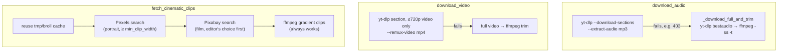

# Deep Dive: Sourcing

**File:** [`modules/sourcing.py`](../../modules/sourcing.py)

**Output:** `tmp/audio.mp3`, `tmp/source_video.mp4` (video background only), `tmp/broll/*.mp4` (stock footage / word-pop)

---

## Overview

Gets the media the rest of the pipeline needs: the recitation audio from YouTube, optionally the matching video section, and stock clips when footage is wanted.

## Responsibilities

- Cut exactly `[start-time, start-time + duration]` of audio from a YouTube video
- Cut the same section of the video itself for `--background video`
- Survive YouTube refusing partial downloads
- Fetch quality-filtered stock clips (Pexels, then Pixabay, then generated gradients)

## Architecture

## Key functions

| Function | What it does |
|---|---|
| `download_audio(url, start_time, duration, output_path)` | Section download with yt-dlp (`--force-keyframes-at-cuts`, best audio → MP3). On failure: full-track download + local trim |
| `download_video(url, start_time, duration, output_path)` | Same section of the video (≤ 720p — it's blurred anyway), video-only MP4, with the same fallback |
| `fetch_cinematic_clips(config, n_clips)` | Up to `n_clips` background clips, cached in `tmp/broll/` within a run |
| `_download_full_and_trim(...)` | Fallback: `yt-dlp -f bestaudio`, then `ffmpeg -ss -t` to MP3; deletes the full file |
| `_hms_to_seconds(s)` | Accepts `HH:MM:SS`, `MM:SS` or plain seconds |

## Implementation notes

- **Why the fallback exists:** section downloads make ffmpeg stream directly from YouTube's CDN, which YouTube intermittently answers with HTTP 403. yt-dlp's own downloader handles the full file reliably; trimming locally is fast.
- Pexels keys come from `PEXELS_API_KEY` (env / `.env`) or `sourcing.pexels_api_key`; Pixabay likewise.
- Generated gradient clips are only used by word-pop. The mushaf `ambient` background ignores them and uses the generative scene instead when Pexels returns nothing.

## Dependencies

yt-dlp (CLI), ffmpeg, requests.

## Potential improvements

- Detect and skip YouTube intros automatically (start at the first recited word).
- Local-file input (`--file recitation.mp3`) to skip YouTube entirely.
