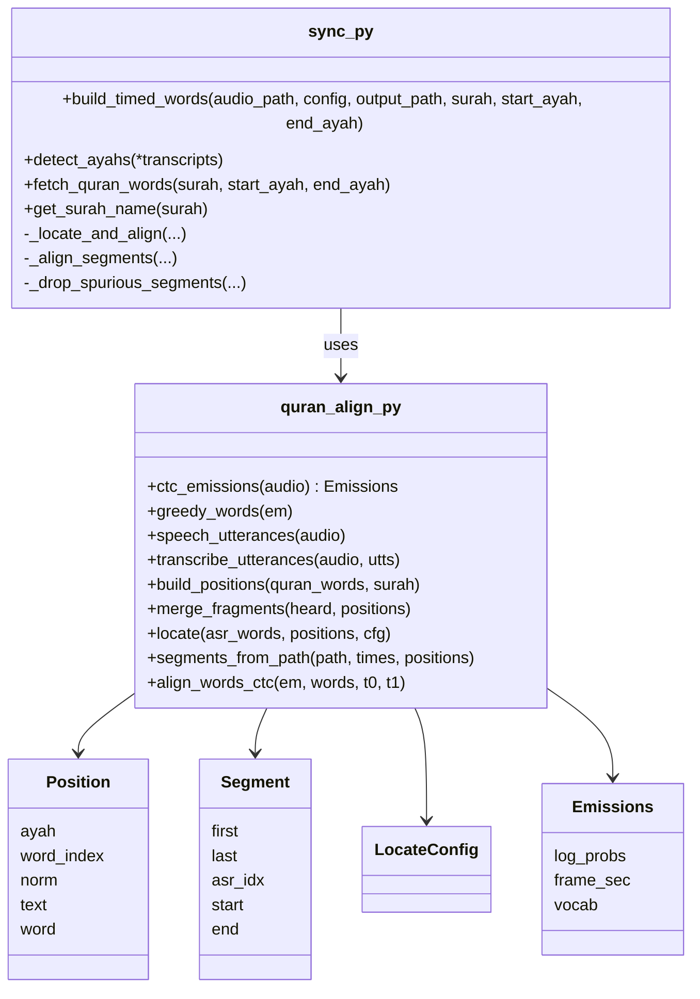

# Deep Dive: Sync

**Files:** [`modules/sync.py`](../../modules/sync.py) (orchestration, Quran data) · [`modules/quran_align.py`](../../modules/quran_align.py) (alignment engine)

**Input:** `tmp/audio.mp3` · **Output:** `tmp/timed_words.json`, `tmp/sync_meta.json`

---

## Overview

The sync module answers: *which Quran words are recited, and exactly when?* — including repeats, partial repeats, pauses, a late start, isti'adha/basmala, and audio cut mid-ayah.

It works in three moves: **listen** (recognise what is said, with times), **locate** (find each heard word's position in the Quran text), **align** (time each located run of words precisely).

### Why not "just force-align the text"?

An earlier version guessed the text up front (which ayahs, how many repeats) and forced it onto the audio. Any wrong guess — a missed repeat, a restart from the middle of an ayah — shifted every word after it. Generic Whisper also silently collapses repeated phrases, so repeats were invisible. The current design never guesses: it only aligns text it has located in what was actually heard.

---

## Responsibilities

- Recognise speech with two complementary models
- Detect the surah and ayah range (unless overridden)
- Fetch the exact Uthmani words from Quran.com
- Locate heard words in the Quran text (Viterbi)
- Cut segments and force-align them precisely
- Post-process (tail cleanup, word-pop display windows) and save

---

## Architecture

---

## Implementation details

### 1. Listen — two word sources

| Source | Model | Strength | Weakness |
|---|---|---|---|
| **CTC words** | `jonatasgrosman/wav2vec2-large-xlsr-53-arabic` | Frame-exact times (20 ms); never merges repeated phrases | Word boundaries shatter under heavy melisma/reverb |
| **Whisper words** | `tarteel-ai/whisper-base-ar-quran` | Clean Quranic spelling even in *mujawwad* | No reliable word times; merges repeats within one context |

- `ctc_emissions` runs wav2vec2 over the clip in 20 s chunks with 2 s overlap (bounded memory), on Apple MPS when available, and stitches the chunk centres into one `[frames × letters]` log-probability matrix. This matrix is reused for the final alignment — the model runs once.
- `greedy_words` decodes it into words with times (word breaks at `|`, `-` or long blanks).
- `speech_utterances` splits the audio at pauses using **plain energy** (silence = 25 dB below the loud level, ≥ 0.3 s). Neural VADs and CTC blanks both mistake long melodic vowels for silence. Utterances longer than 15 s are cut at their quietest point.
- `transcribe_utterances` runs the Quran Whisper on each utterance separately — short contexts stop Whisper from merging a repeat into the previous recitation. Word times are estimated within each utterance.

> The tarteel checkpoint ships an outdated generation config; it's replaced with `openai/whisper-base`'s so the `language` argument works.

### 2. Detect the passage

`detect_ayahs(*transcripts)` slides a window of 1–15 consecutive ayahs over the whole Quran (diacritic-free text from alquran.cloud, cached in `tmp/quran_clean.json`) and scores each window by **character-bigram Jaccard overlap** with each transcript, keeping the best. Below 25% it stops and asks for manual flags.

The detected range is only a *hint*: the text fetched for locating is widened by `sync.search_margin_ayahs` (2) on each side. Extra ayahs are harmless because the locator only uses what it hears.

`build_positions` flattens the fetched words into searchable **positions**, preceded by optional isti'adha and basmala positions (basmala skipped for surahs 1 and 9). Every position carries a normalised spelling for matching (`normalize`: no harakat, unified alef/hamza/ta-marbuta/alef-maqsura forms).

### 3. Locate — Viterbi over Quran positions

`locate(asr_words, positions, cfg)` finds the most likely position for every heard word. It's an HMM-style dynamic program over *positions + a JUNK state*:

- **Emission score**: `emit_scale × (similarity − match_floor)` where `similarity` is normalised edit distance (tolerant of a glued و/ف prefix). JUNK always scores 0, so a word matches a position only if it's more similar than `match_floor` (0.55).
- **Transitions** (`LocateConfig` defaults):

| Move | Meaning | Cost |
|---|---|---|
| `+1` | next word | 0 |
| `+2…+4` | recogniser missed 1–3 words | `skip_cost` (0.8) per word |
| `0` | one word split in two | `stay_cost` (0.6) |
| back, within 2 ayahs | **repeat / partial repeat** | `repeat_cost` (1.5) |
| far jump | reciter skipped ahead / unlikely | `jump_cost` (4.0) |
| → JUNK / JUNK → JUNK / JUNK → | non-Quran speech | 1.2 / 0.2 / 0.8 |
| start anywhere but the first position | late start / mid-ayah start | `start_cost` (0.5) |

All costs are overridable under `sync:` in `config.yaml`.

**Fragment merging (CTC source only).** Slow recitation makes the CTC split one word into pieces (`الا` `نسا` `ن` = الإنسان). `merge_fragments` joins adjacent pieces when their concatenation matches a Quran word (≥ 0.7) clearly better (+0.1) than either piece alone. Two real words never concatenate into one Quran word, so they stay apart.

### 4. Segments

`segments_from_path` turns the path into **segments** — runs of consecutive positions:

- a **backward jump starts a new segment** (that's a repeat);
- a forward jump of more than `max_skip` starts a new segment;
- isti'adha, basmala and ayah text are always separate segments;
- up to 6 unmatched words in a row don't break a segment (fragments of slow words); more do;
- the *same* position again continues the segment only if it follows within 1.0 s (or 2.5 s with nothing unmatched in between) — otherwise the reciter restarted from that word, i.e. a repeat.

`_drop_spurious_segments` then removes single-word segments that are weak or short (coincidental matches like من / الله inside noise).

### 5. Align — CTC forced alignment per segment

`_align_segments` force-aligns each segment's **exact Quran text** (`torchaudio.functional.forced_align`) inside its own window: from just before its first heard word to just after its last, clamped between the neighbouring segments. Short windows + exactly known text = reliable word boundaries. Words the recogniser missed inside a segment get timed here too, because the whole Quran span is aligned.

**Edge repair.** The recogniser often misses the first or last word(s) of an ayah, so a segment may start mid-ayah. Each edge is tentatively extended to the ayah boundary with a window up to 8 s wider (a single word with a long madd/ghunna can last 4 s). The extension is kept only if the alignment confidence (mean token log-probability) stays within 0.3 — real speech aligns well; silence or a different recitation doesn't. Genuine partial repeats therefore keep their mid-ayah start.

**Low confidence.** Below `min_segment_confidence` (−2.5), a segment with < 4 heard words is dropped; otherwise its words are spread over the heard span.

### 6. Choose and save

Both sources go through locate → segment → align; the result with **more aligned words** wins (`Aligned words per source (CTC: 28, Whisper: 28) → using CTC`). Then:

- `_drop_crammed_tail` removes words squeezed into < 0.12 s at the very end (audio cut mid-word);
- `_compute_display_windows` adds `display_start/end` for word-pop;
- `timed_words.json` and `sync_meta.json` (`surah`, `start_ayah`, `end_ayah` — only real ayahs, not basmala) are written.

Isti'adha claims its audio but is never emitted; basmala is emitted as ayah `0` with Uthmani display text.

---

## Dependencies

- **Internal:** `modules/quran_align.py`
- **External:** PyTorch, torchaudio (< 2.9, for `forced_align`), Transformers, NumPy, requests, ffmpeg (audio decoding)
- **Services:** Quran.com v4 (`/verses/by_key`, `/chapters`), alquran.cloud (`/quran/ar.simple`, `/surah/{n}/en.sahih`), Hugging Face Hub (first run)

## Testing

- `tests/test_quran_locate.py` — locator and segmentation on synthetic word streams
- `tests/test_sync_tail.py`, `tests/test_sync_windows.py` — post-processing
- `tests/bench_sync.py` — end-to-end accuracy with exact ground truth ([Testing](../07-testing.md))

## Potential improvements

- **Mujawwad**: heavy melisma + reverb is still only partially aligned. A Quran-specific CTC model (character-level, trained on recitations) would likely help most.
- Use the tarteel model's own word timestamps once a compatible alignment-heads config is available.
- Cache emissions per audio file to speed up repeated renders of the same clip.
