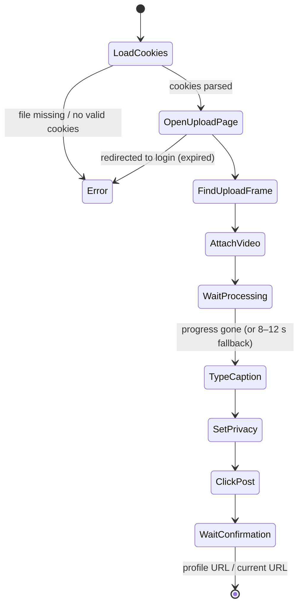

# Deep Dive: Uploader

**File:** [`modules/uploader.py`](../../modules/uploader.py)

> Automating TikTok violates its Terms of Service. See the warnings in [TikTok Upload](../04-tiktok-upload.md).

---

## Overview

Posts the finished video to TikTok by driving TikTok's web creator page in headless Chromium, authenticated with cookies exported from your browser. No TikTok API or developer account is involved.

## Responsibilities

- Load a Netscape `cookies.txt` into a browser context
- Open the upload page and detect expired sessions
- Attach the video, wait for processing
- Type the caption, set privacy, click Post
- Return the resulting URL

## Flow



## Key functions

| Function | What it does |
|---|---|
| `upload_to_tiktok(video_path, cookies_file, caption, privacy)` | Entry point; launches Chromium with a desktop user agent and `AutomationControlled` disabled |
| `_load_cookies` | Parses tab-separated Netscape lines into Playwright cookies |
| `_do_upload` | The step sequence above |
| `_get_upload_frame` | The upload UI lives in an iframe; finds it (falls back to the main frame) |
| `_set_caption` | Tries several selectors, types character by character with 20–60 ms delays |
| `_set_privacy` | Opens the permission dropdown, picks *Only you* / *Friends* / *Everyone* |
| `_click_post` | Tries several selectors, then the accessible "Post" button |
| `_human_delay` | Random sleeps between actions to look less robotic |

## How the caption is built (in `main.py`)

```
caption  = config.tiktok.caption.format(surah_name_ar=…, surah_name_en=…)
         # e.g. "الملك | Surah Al-Mulk"
posted   = caption + "\n" + config.tiktok.hashtags
```

The surah comes from `--surah` or, when auto-detected, from `tmp/sync_meta.json`.

## Fragility

Every selector depends on TikTok's current HTML. When TikTok ships a UI change, `_set_caption` / `_click_post` log a `Warning:` instead of crashing. Updating the selector lists is usually enough.

## Dependencies

Playwright (Chromium).

## Potential improvements

- Use TikTok's official Content Posting API where available (requires app approval).
- Headful "assist" mode that fills everything in and lets you press Post yourself.
